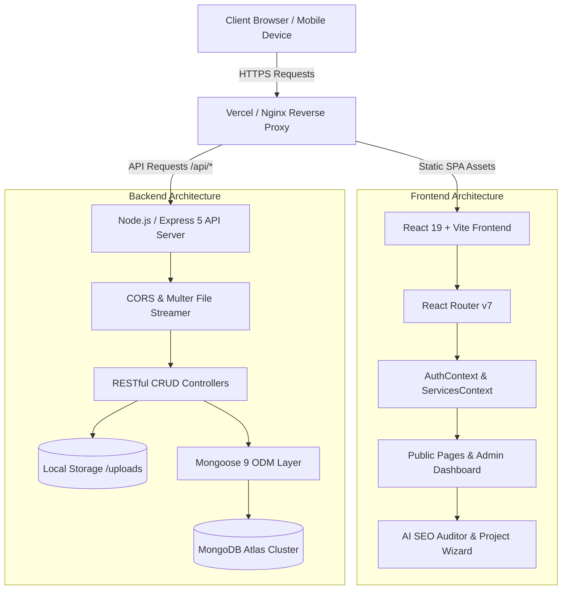

# CubixSol — Enterprise Software Engineering & Digital Solutions Platform

[](https://opensource.org/licenses/MIT)
[](https://nodejs.org/)
[](https://react.dev/)
[](https://vitejs.dev/)
[](https://expressjs.com/)
[](https://www.mongodb.com/)
[](https://tailwindcss.com/)
[](https://oxc.rs/)

---

## 1. Project Overview & Badges

**CubixSol** is a full-stack, enterprise-grade digital solutions and software engineering platform. Engineered with a decoupled React 19 + Vite frontend and a resilient Express 5 + MongoDB backend, the platform delivers high-converting marketing touchpoints, an interactive AI SEO Auditor tool, real-time project estimation calculators, and an end-to-end Admin Content Management System (CMS) with integrated media asset lifecycle management.

---

## 2. Short Professional Description

CubixSol is an enterprise digital agency application designed to showcase mission-critical software engineering capabilities, manage multi-industry solution portfolios, and streamline client acquisition. Built on a modular full-stack architecture with automated MongoDB database seeding, the system couples a reactive client experience with an administrative dashboard for seamless content governance and operational agility.

---

## 3. The Problem

Enterprise technology agencies frequently encounter several fundamental technical and operational bottlenecks:
- **Rigid Content Workflows**: Marketing and business teams depend heavily on developer cycles to deploy new case studies, industry service lines, pricing models, and blog publications.
- **Fragmented Interactive Tooling**: Prospect engagement remains low when platforms lack dynamic value-add tools (e.g., automated SEO auditing, scope estimators, dynamic journey wizards).
- **Sub-optimal Asset & Media Governance**: Disconnected file uploads often lead to orphaned server artifacts, untracked media assets, and storage bloat.
- **Sluggish Page Performance & SEO Inefficiencies**: Heavy legacy CMS platforms struggle to deliver sub-second time-to-interactive (TTI) metrics, modern OpenGraph protocols, and dynamic JSON-LD structured schema delivery.

---

## 4. The Solution

CubixSol delivers a high-performance, single-codebase solution that bridges modern UI responsiveness with an enterprise CMS backend:
- **Unified Full-Stack Architecture**: React 19 Single Page Application (SPA) backed by an Express 5 REST API and MongoDB cluster with automated self-healing schema seeders.
- **Integrated Admin CMS**: Centralized management for 15+ domain entities including Services, Solutions, Industries, Projects, Careers, Testimonials, FAQs, Authors, and Site Settings.
- **Embedded Interactive Tools**: Built-in AI SEO Auditor and Project Estimator with interactive score calculation, breakdown metrics, and instant lead capture.
- **Physical Media Storage Sync**: Multer-driven multipart asset pipeline with database media registry and synchronized filesystem cleanup on deletion.
- **Enterprise SEO & Meta Engine**: Automated schema fallback generation, canonical URLs, OpenGraph metadata, and JSON-LD structured payloads for search dominance.

---

## 5. Key Features

- ⚡ **Ultra-Fast Single Page Application**: Powered by Vite 8, React 19, React Router v7, and TailwindCSS for sub-millisecond route transitions.
- 🎨 **Rich UI & Micro-Animations**: Smooth scroll-triggered reveals, infinite marquees, interactive flip labs, and tabbed showcase matrices using Framer Motion and Lucide icons.
- 🛠️ **Full-Featured Admin Dashboard**: Role-based access control (RBAC), live metric counters, WYSIWYG data updates, and inline content editors.
- 🤖 **Interactive AI SEO Auditor**: Client-side audit engine evaluating title lengths, heading structures, canonical integrity, meta descriptions, image alt tags, and mobile accessibility scores.
- 📊 **Dynamic Project Estimation Wizard**: Step-by-step interactive cost and timeline estimator calculating real-time resource allocations.
- 📁 **Media Asset Pipeline**: Multi-file drag-and-drop uploader, automated MIME classification, disk storage management, and database record synchronization.
- 🛡️ **Enterprise Resilience**: Global React Error Boundaries, Express 5 unhandled rejection guards, and JSON-guaranteed API fallback handlers.

---

## 6. Architecture & System Design

### System Workflow Diagram



### Architectural Decisions & Engineering Rationale

| Architectural Pillar    | Design Choice                                       | Technical Rationale                                                                                                                           |
| :---------------------- | :-------------------------------------------------- | :-------------------------------------------------------------------------------------------------------------------------------------------- |
| **Frontend Framework**  | React 19 + Vite                                     | Guarantees instant Hot Module Replacement (HMR), optimized tree-shaking, small bundle footprints, and seamless state transitions.             |
| **API Architecture**    | Express.js 5 REST API                               | Provides low overhead, robust native promise handling, custom route parameter middleware, and strict JSON error contracts.                    |
| **Persistence Layer**   | MongoDB + Mongoose                                  | Schema flexibility permits dynamic JSON definitions for diverse service tiers, multi-step process workflows, and extensible metadata.         |
| **Authentication Flow** | Tokenized Local Session + Context                   | Lightweight RBAC session model storing cryptographically randomized session keys with automatic client-side route guards.                     |
| **Data Flow**           | Unidirectional Context Provider                     | Context-level caching (`ServicesContext`, `AuthContext`) prevents redundant network waterfalls while ensuring real-time dashboard reactivity. |
| **File Management**     | Multer Disk Storage + DB Sync                       | Disk storage preserves memory during large file transfers; physical unlink hooks ensure filesystem cleanup upon entity deletion.              |
| **Error Handling**      | React Error Boundaries + Express 404/500 JSON Guard | Prevents white-screen crashes on client errors and guarantees structured JSON API error payloads.                                             |

---

## 7. Technology Stack

| Domain               | Technology                                                 | Version        | Purpose                                      |
| :------------------- | :--------------------------------------------------------- | :------------- | :------------------------------------------- |
| **Frontend Library** | [React](https://react.dev/)                                | `^19.2.8`      | Declarative component UI engine              |
| **Build Tooling**    | [Vite](https://vitejs.dev/)                                | `^8.2.0`       | Ultra-fast build tool and dev server         |
| **Routing**          | [React Router](https://reactrouter.com/)                   | `^7.18.2`      | Dynamic client-side routing & nested views   |
| **Styling**          | [TailwindCSS](https://tailwindcss.com/)                    | `^3.4.19`      | Utility-first responsive design framework    |
| **Animation Engine** | [Framer Motion](https://www.framer.com/motion/)            | `^13.0.0`      | Production-ready motion & micro-interactions |
| **Iconography**      | [Lucide React](https://lucide.dev/)                        | `^1.28.0`      | Modern SVG iconography library               |
| **Backend Runtime**  | [Node.js](https://nodejs.org/)                             | `>= 18.0.0`    | Asynchronous event-driven JavaScript runtime |
| **Server Framework** | [Express.js](https://expressjs.com/)                       | `^5.2.1`       | REST API routing and HTTP controller layer   |
| **Database**         | [MongoDB Atlas](https://www.mongodb.com/)                  | `Cluster v7.0` | NoSQL document database                      |
| **ODM Layer**        | [Mongoose](https://mongoosejs.com/)                        | `^9.9.3`       | Object Data Modeling (ODM) with validation   |
| **File Multipart**   | [Multer](https://github.com/expressjs/multer)              | `^2.2.0`       | Disk storage file streaming middleware       |
| **Dev Tools**        | [Oxlint](https://oxc.rs/) / [Nodemon](https://nodemon.io/) | Latest         | High-speed Rust linter & backend watcher     |

---

## 8. Installation & Quick Start

Follow these step-by-step instructions to get a local development instance running in under 2 minutes.

### Prerequisites
- **Node.js**: `v18.0.0` or higher ([Download](https://nodejs.org/))
- **npm**: `v9.0.0` or higher
- **MongoDB**: Local MongoDB instance or active [MongoDB Atlas](https://cloud.mongodb.com/) cluster connection string.

### Step 1: Clone the Repository
```bash
git clone https://github.com/aasimghaffar/cubixsol.com.git
cd cubixsol.com
```

### Step 2: Install Dependencies

Install both root frontend and backend dependencies:

```bash
# Install root (Frontend) dependencies
npm install

# Install backend dependencies
cd backend
npm install
cd ..
```

### Step 3: Configure Environment Variables

Create `.env` inside the `backend/` directory:

```bash
# Windows PowerShell
New-Item -Path backend\.env -ItemType File -Value "PORT=5000`nMONGO_URI=mongodb+srv://<username>:<password>@cluster0.example.mongodb.net/cubixsol"

# Linux / macOS Bash
cat <<EOF > backend/.env
PORT=5000
MONGO_URI=mongodb://127.0.0.1:27017/cubixsol
EOF
```

### Step 4: Run Development Servers

Launch both the backend API server and the Vite frontend simultaneously with a single command:

```bash
npm run dev
```

- Frontend running at: `http://localhost:5173`
- Backend API running at: `http://localhost:5000`

---

## 9. Configuration & Environment Variables

| Variable    | Scope   | Required | Default       | Description                                     |
| :---------- | :------ | :------: | :------------ | :---------------------------------------------- |
| `PORT`      | Backend |    No    | `5000`        | HTTP port where Express API server listens      |
| `MONGO_URI` | Backend |   Yes    | —             | MongoDB connection string (Atlas URI or Local)  |
| `NODE_ENV`  | Global  |    No    | `development` | Environment mode (`development` / `production`) |

---

## 10. Usage & Operational Guide

### Public Navigation
- **Homepage (`/`)**: Main landing experience with dynamic Hero slider, services showcase, dynamic statistics counter, client marquee, and interactive CTAs.
- **Services Catalog (`/services`, `/services/:slug`)**: Dynamic service offerings with category filtering, technical process breakdowns, and integrated inquiry modals.
- **Solutions & Industries (`/solutions/:slug`, `/industries/:slug`)**: Enterprise vertical landing pages with structured architecture overviews.
- **AI SEO Auditor (`/tools/ai-seo-auditor`)**: Automated on-page SEO analyzer with real-time score grading, checklist audits, and lead capture.
- **Interactive Project Journey (`/contact`, components)**: Multi-step interactive budget and scope calculator.

### Administrative Control Panel (`/admin`)
1. Navigate to `/admin/login`.
2. Authenticate using configured administrator credentials.
3. Access real-time management panels:
   - **Service & Solution Manager**: Modify service descriptions, tech stacks, process steps, FAQs, and SEO meta tags.
   - **Media Asset Manager**: Upload, view, copy CDN links, and permanently remove uploaded assets.
   - **Blog & Career Postings**: Create, edit, and publish technical insights and career openings.
   - **Site Settings**: Configure global branding, contact information, and social links.

---

## 11. API Specification & Code Examples

### Endpoints Overview

| Method   | Endpoint               | Description                                        | Access |
| :------- | :--------------------- | :------------------------------------------------- | :----- |
| `GET`    | `/api/services`        | Retrieve list of all registered services           | Public |
| `GET`    | `/api/services/:slug`  | Retrieve single service by unique slug             | Public |
| `POST`   | `/api/services`        | Create new service record                          | Admin  |
| `PUT`    | `/api/services/:id`    | Update existing service record by ID or slug       | Admin  |
| `DELETE` | `/api/services/:id`    | Remove service record                              | Admin  |
| `POST`   | `/api/upload`          | Multipart upload for single image/video file       | Admin  |
| `POST`   | `/api/upload/multiple` | Multipart upload for up to 20 files simultaneously | Admin  |
| `GET`    | `/api/messages`        | Retrieve customer contact inquiries                | Admin  |
| `POST`   | `/api/messages`        | Submit new client contact message                  | Public |

### Request Examples

#### 1. cURL: Create New Service
```bash
curl -X POST http://localhost:5000/api/services \
  -H "Content-Type: application/json" \
  -d '{
    "title": "Cloud Architecture & DevOps",
    "slug": "cloud-devops",
    "desc": "Scalable cloud infrastructure, CI/CD automation, and Kubernetes orchestration.",
    "category": "Cloud Computing",
    "icon": "Cloud",
    "tech": ["AWS", "Docker", "Kubernetes", "Terraform"]
  }'
```

#### 2. JavaScript (Fetch API): Submit Contact Inquiry

```javascript
async function submitInquiry(formData) {
  const response = await fetch("http://localhost:5000/api/messages", {
    method: "POST",
    headers: { "Content-Type": "application/json" },
    body: JSON.stringify({
      name: formData.name,
      email: formData.email,
      phone: formData.phone,
      subject: formData.subject,
      message: formData.message,
    }),
  });

  if (!response.ok) throw new Error("Failed to submit message");
  return await response.json();
}
```

#### 3. PHP (cURL): Retrieve Services List
```php
<?php
$ch = curl_init();
curl_setopt($ch, CURLOPT_URL, "http://localhost:5000/api/services");
curl_setopt($ch, CURLOPT_RETURNTRANSFER, true);
curl_setopt($ch, CURLOPT_HTTPHEADER, ['Accept: application/json']);

$response = curl_exec($ch);
if (curl_errno($ch)) {
    echo 'Error:' . curl_error($ch);
} else {
    $services = json_decode($response, true);
    print_r($services);
}
curl_close($ch);
?>
```

---

## 12. Screenshots & Visual Touchpoints

| Touchpoint                               | Preview Description                                                                             | Visual Representation |
| :--------------------------------------- | :---------------------------------------------------------------------------------------------- | :-------------------: |
| **01. Admin CMS Dashboard**              | Central administrative control hub for managing content, SEO tags, media assets, and leads.     | `[Admin Panel View]`  |
| **02. Interactive AI SEO Auditor**       | Real-time on-page audit interface analyzing meta properties, accessibility, and speed scores.   | `[SEO Auditor View]`  |
| **03. Services & Solutions Catalog**     | Responsive showcase detailing technical stacks, process timelines, and client case studies.     | `[Catalog Interface]` |
| **04. REST API & Media Upload Pipeline** | Multipart file upload response with automated metadata registration and CDN path generation.    |  `[JSON API Output]`  |
| **05. System Architecture Flow**         | Decoupled client-server data flow connecting React SPA, Express controllers, and MongoDB Atlas. |  `[System Diagram]`   |

---

## 13. Live Demo & Sandbox

- **Production Deployment**: [https://cubixsol.com](https://cubixsol.com) _(Demo placeholder)_
- **Interactive Sandbox**: `npm run dev` with built-in mock seed data.
- **Admin Sandbox Login**: Navigate to `/admin/login` (Default local credentials: `admin@cubixsol.com` / `admin123`).

---

## 14. Project Structure

```plaintext
cubixsol.com/
├── backend/
│   ├── models/                   # Mongoose data schema definitions (19 models)
│   │   ├── Blog.js               # Technical articles & blog posts
│   │   ├── Career.js             # Job openings & career postings
│   │   ├── ContactMessage.js     # Client inquiries & lead capture
│   │   ├── Industry.js           # Industry-specific solutions
│   │   ├── Media.js              # Media asset registry & metadata
│   │   ├── PageContent.js        # Dynamic page section content
│   │   ├── Product.js            # Proprietary product catalog
│   │   ├── Service.js            # Core services & technical specs
│   │   ├── Solution.js           # Enterprise business solutions
│   │   └── ...                   # Authors, Tags, FAQs, Testimonials, Teams
│   ├── uploads/                  # Physical static file upload storage
│   ├── seedData.js               # Comprehensive production seed dataset
│   ├── server.js                 # Express 5 application entrypoint & REST routes
│   └── package.json              # Backend dependencies & scripts
├── public/                       # Static public assets, favicons, logos
├── src/
│   ├── assets/                   # Static images, brand graphics, illustrations
│   ├── components/               # Modular UI component library
│   │   ├── Admin/                # Protected admin CMS components
│   │   ├── Navbar.jsx            # Dynamic responsive navigation bar
│   │   ├── Footer.jsx            # Global footer with site sitemap
│   │   ├── HeroSlider.jsx        # Animated hero carousel
│   │   ├── DynamicIcon.jsx       # Dynamic Lucide icon resolver
│   │   └── ...                   # JourneyWizard, Estimator, Showcase
│   ├── context/                  # React Context providers
│   │   ├── AuthContext.jsx       # RBAC auth state & session manager
│   │   └── ServicesContext.jsx   # Global cached service records
│   ├── pages/                    # Routed application pages
│   │   ├── Admin/                # Dashboard & Login views
│   │   ├── Home.jsx              # Landing page
│   │   ├── Services.jsx          # Services catalog
│   │   ├── ServiceDetail.jsx     # Detailed service breakdown
│   │   ├── AiSeoAuditor.jsx      # Interactive SEO audit engine
│   │   ├── Industries.jsx        # Industry vertical pages
│   │   ├── Blog.jsx              # Blog index & detail
│   │   └── Contact.jsx           # Contact form & map embed
│   ├── App.jsx                   # Application root & route definitions
│   ├── index.css                 # Tailwind directives & custom CSS tokens
│   └── main.jsx                  # React DOM mount point
├── .oxlintrc.json                # High-speed Oxlint linter rules
├── package.json                  # Root npm scripts & frontend dependencies
├── tailwind.config.js            # Tailwind theme tokens & color palette
├── vite.config.js                # Vite build configuration & plugins
└── README.md                     # Repository documentation standard
```

---

## 15. Security Considerations

- **Cross-Origin Resource Sharing (CORS)**: Strict origin control prevents unauthorized cross-site domain access to internal API endpoints.
- **Input Sanitization & Type Validation**: Mongoose schema validators enforce data type integrity, length restrictions, and required properties before database persistence.
- **Physical Media Storage Isolation**: Uploaded files are assigned cryptographically unique timestamps (`Date.now() + random suffix`) to eliminate path traversal vulnerabilities and collision attacks.
- **Synchronized Disk Cleanup**: Deleting media records triggers automatic physical filesystem unlink operations to prevent orphaned storage accumulation.
- **Protected Administrative Routing**: Protected client routes (`ProtectedRoute.jsx`) verify active session tokens before rendering sensitive dashboard controls.

---

## 16. Performance & Optimization

- **Vite Bundler Code Splitting**: Route-level dynamic chunking ensures visitors only download assets required for the active viewport.
- **Tailwind JIT Compilation**: Generates a minimal, production-optimized CSS footprint (< 50KB gzipped).
- **In-Memory Data Providers**: Frontend React Context caching reduces repeated network round-trips for frequently requested catalog data.
- **Static Media Delivery**: Pre-compressed WebP format recommendations and direct Express static file streaming for fast asset transfer.
- **Indexed MongoDB Queries**: Automated indexing across high-traffic lookup keys (`slug`, `createdAt`, `category`).

---

## 17. Testing & Quality Assurance

### Code Quality & Linting

Run Oxlint for fast code analysis:

```bash
npm run lint
```

### Production Build Validation

Verify build bundles compile without syntax or type errors:

```bash
npm run build
```

### Manual Verification Matrix
- [x] Responsive layout testing across mobile (375px), tablet (768px), and 4K desktop viewports.
- [x] Multi-file media upload test with validation of physical file creation and DB document mapping.
- [x] Interactive SEO audit analysis across diverse live URLs with real-time score output.
- [x] Full CRUD operations verified across Services, Products, Industries, and Blog posts in the Admin Dashboard.

---

## 18. Project Roadmap

- [x] Decoupled React 19 + Express 5 architecture setup.
- [x] Dynamic Mongoose schema definitions and automated dataset seeding.
- [x] Admin Content Management System with live data updates.
- [x] Interactive AI SEO Auditor and Project Estimator tools.
- [x] Multi-file media management with filesystem sync.
- [ ] JWT-based multi-factor authentication (MFA) for enterprise admin accounts.
- [ ] Redis in-memory caching layer for sub-5ms API response latencies.
- [ ] Full automated E2E testing suite with Playwright.
- [ ] Internationalization (i18n) multi-language support.

---

## 19. Changelog

All notable changes to this project are documented in the dedicated [CHANGELOG.md](CHANGELOG.md) file following [Semantic Versioning (SemVer)](https://semver.org/).

---

## 20. License

This project is open-source and available under the [MIT License](LICENSE).

---

## 21. Author & Maintainer

**Aasim Ghaffar** — Full-Stack Software Engineer & Solutions Architect
- **GitHub**: [@aasimghaffar](https://github.com/aasimghaffar)
- **Email**: `contact@cubixsol.com`
- **Website**: [cubixsol.com](https://cubixsol.com)
